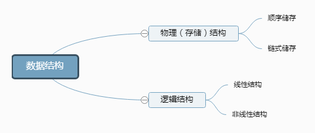

数据结构，物理结构，存储结构，逻辑结构……是不是很晕？
[原文——blog](https://www.cnblogs.com/xieyang-blog/p/8516113.html)

今天教大家来区分并且判别各个结构。
什么是逻辑结构？
　简单说，逻辑结构就是数据之间的关系。而按数据之间的关系来说，逻辑结构大概可以分为两种：线性结构和非线性结构（集合、树、网）。

线性结构：有且只有一个开始结点和一个终端结点，并且所有结点都最多只有一个直接前驱和一个直接后继。例如：线性表，典型的线性表有：顺序表、链表、栈（顺序栈、链栈）和队列（顺序队列、链队列）。它们共同的特点就是数据之间的线性关系，除了头结点和尾结点之外，每个结点都有唯一的前驱和唯一的后继，也就是所谓的一对一的关系。
非线性结构：对应于线性结构，非线性结构也就是每个结点可以有不止一个直接前驱和直接后继。常见的非线性结构包括：树（二叉树）、图（网）等。
什么是存储结构？
　逻辑结构指的是数据间的关系，而存储结构是逻辑结构的存储映像。通俗的讲，可以将存储结构理解为逻辑结构用计算机语言的实现。常见的存储结构有顺序存储、链式存储、索引存储以及散列存储（哈希表）。

顺序存储：把逻辑上相邻的节点存储在物理位置上相邻的存储单元中，结点之间的逻辑关系由存储单元的邻接关系来体现。由此得到的存储结构为顺序存储结构，通常顺序存储结构是借助于数组来描述的。优点：节省空间，可以实现随机存取；缺点：插入、删除时需要移动元素，效率低。

链式存储：在计算机中用一组任意的存储单元存储线性表的数据元素(这组存储单元可以是连续的,也可以是不连续的)。特点是元素在物理上可以不相邻，所以每个数据元素包括了一个数据域和一个指针域，数据域用来存放数据，而指针域用来指向其后继结点的位置。优点：插入、删除灵活；缺点：不能随机存取，查找速度慢。

逻辑结构和存储结构的区别和判断
　这两者并不冲突，一个指的是数据之间的关系，而另一个指这种关系在计算机中的表现形式。比如，线性表中的栈，数据元素之间的关系是一对一的，除头和尾结点之外的每个结点都有唯一的前驱和唯一的后继，这体现的是逻辑结构；而对于栈中的结点来说，它们可以顺序存储（也就是顺序栈），取一段连续的存储空间，将栈结点按顺序存入，每个结点和其前驱和后继在物理上都是相邻的。同时，栈结点也可以链式存储（链栈），每个结点中包括数据域和指针域，而指针域就是用来指向其后继的，在访问时就可以通过指针来找到其后继进行访问，每个结点之间物理上可以相邻也可以不相邻。

　　  下图即是数据结构的划分图（具体枚举不再细列）。

　　　　

 

　　判断：当一个结构，如数组、链表、树、图，在逻辑结构中只有一种定义，而在物理结构中却有两种选择，那么这个结构就属于逻辑结构；

　　　　　　　　相反，当此结构在原有基础上加上了某种限定，使得其在物理结构中只有一种定义，那么这个结构就属于物理（存储）结构；

 

　　举例1：栈属于什么结构？

　　分析：栈在逻辑结构中只能属于线性结构，而在物理结构中它可以使用顺序存储（数组），也可以使用链式存储（链表），所以说栈是一种逻辑结构。

　　举例2：线索二叉树属于什么结构？

　　分析：首先，可以得到二叉树是一种数据结构，但是线索二叉树是加上线索后的链表结构（不能用顺序存储），也就是说，它是计算机内部的只有一种存储结构，所以是物理结构。

　有人肯定问，图是逻辑结构，图难道能用顺序存储吗？答案是肯定的，只是我们一般不这么用，详情见此博客： 
[图的存储结构（数组表示法）及C语言实现](http:/data.biancheng.net/view/37.html)